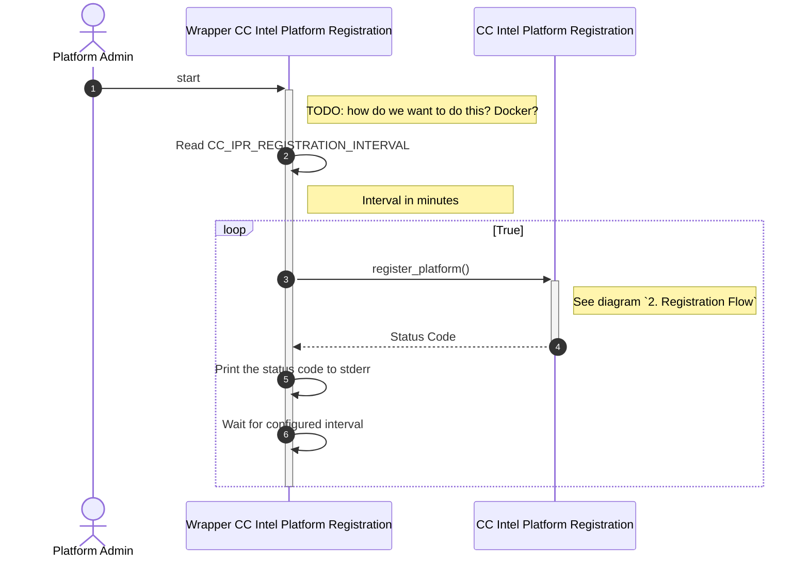
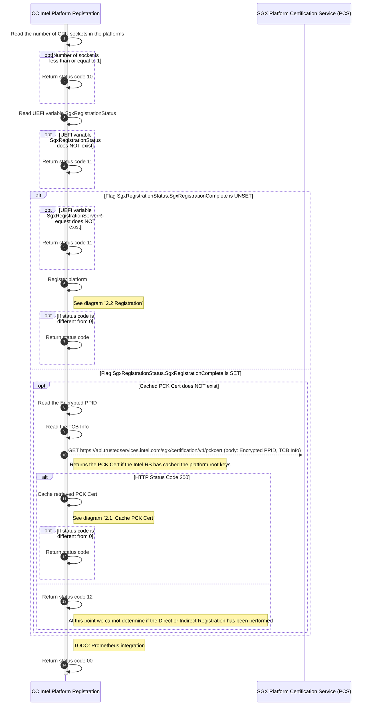
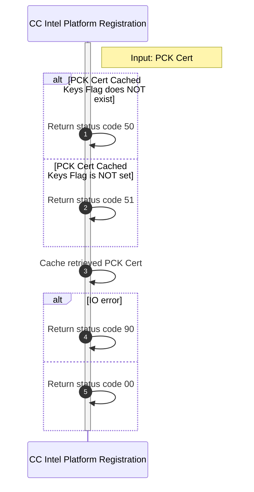
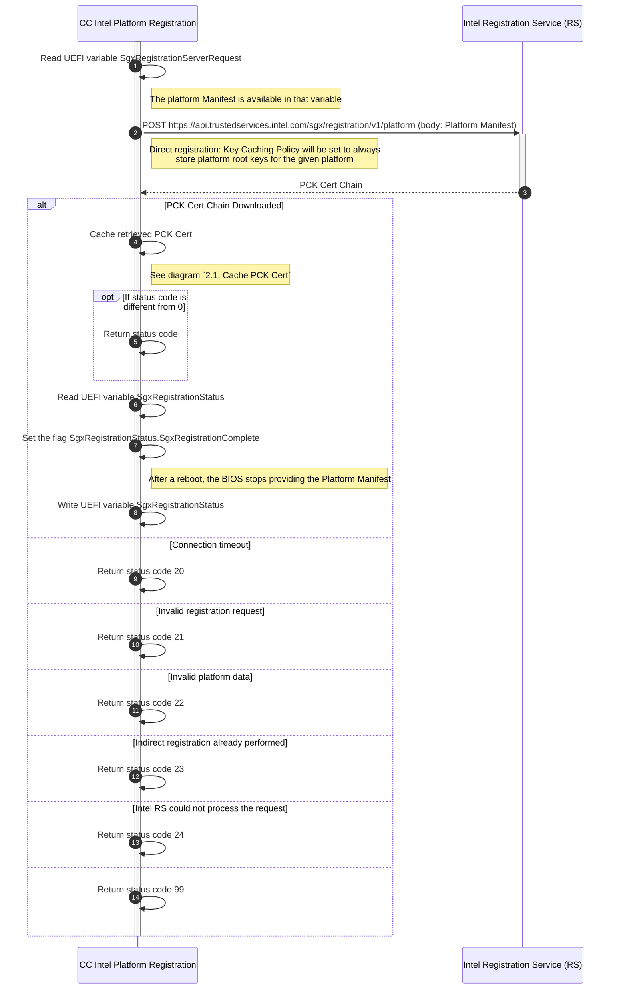

# Platform Registration Flow

## Status Code

The platform registration service keeps a status code described below.

- `00`: Platform registered
- `1X`: SGX Platform status
  - `10`: Single socket platform
  - `11`: UEFI variables not available 
  - `12`: Direct/Indirect Registration already performed (unknown which)
- `2X`: Direct Registration Status
  - `20`: Failed to connect to Intel RS
  - `21`: Invalid registration request
    - Status Code: 400 --- Error Code: InvalidRequestSyntax
    - Status Code: 400 --- Error Code: InvalidPlatformManifest
    - Status Code: 415
  - `22`: Invalid platform data
    - Status Code: 400 --- Error Code: InvalidOrRevokedPackage 
    - Status Code: 400 --- Error Code: PackageNotFound 
    - Status Code: 400 --- Error Code: IncompatiblePackage 
  - `23`: Platform root keys can no longer be cached. Indirect registration already performed
    - Status Code: 400 --- Error Code: CachedKeysPolicyViolation
  - `24`: Intel RS could not process the request
    - Status Code: 500
    - Status Code: 503
- `3X`
- `4X`
- `5X`: PCK Cert Status
  - `50`: PCK Cert issued by PCK Processor CA and no information about the cached platform root keys is available
  - `51`: Platform root keys not cached by the Intel RS (Indirect Registration); this operation mode is not supported
- `9X`: General errors
  - `90`: IO error; see logs
  - `99`: Unknown or not supported error; see logs

## Sequence Diagrams

### 1. Main Flow

### 2. Registration Flow

#### 2.1. Cache PCK Cert

#### 2.2 Registration

## Artifacts

* *Platform manifest*: A BLOB which contains the platform root pub keys used to register the SGX platform with the Intel Registration Service
* *PPID*: Platform Provisioning ID
* *TCB Info*: Compound of SGX TCB state (CPUSVN), PCESVN, and PCEID
* *PCK Cert*: X.509 certificate binding the PCE's key pair to a certain SGX TCB state
* *PCK Cert Cached Keys Flag*: PCK Cert extension under OID `1.2.840.113741.1.13.1.7.2` to state whether the platform root keys are cached by Intel RS

## Documentation

- [Intel SGX DCAP Multipackage SW](https://download.01.org/intel-sgx/sgx-dcap/1.9/linux/docs/Intel_SGX_DCAP_Multipackage_SW.pdf)
- [SGX PCK Certificate Specification](https://download.01.org/intel-sgx/latest/dcap-latest/linux/docs/SGX_PCK_Certificate_CRL_Spec-1.4.pdf)