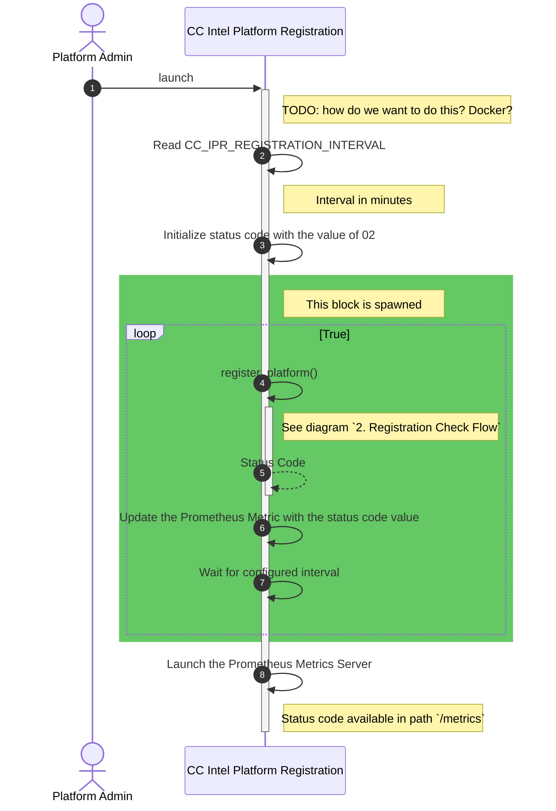
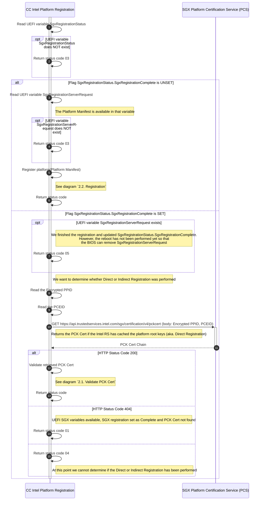
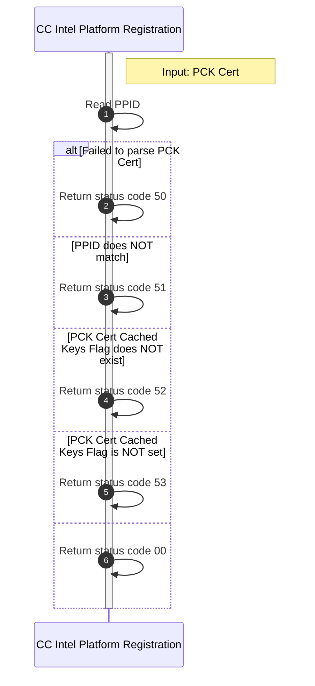
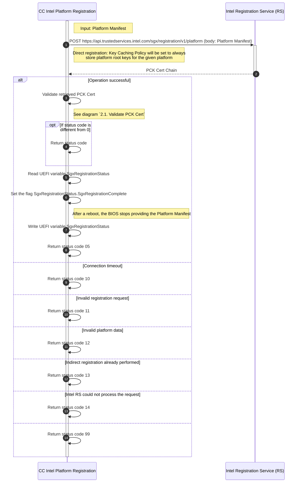

# Platform Registration Flow

## Limitation

- Addition or replacement of CPUs is not supported.

## Status Code

The platform registration service keeps a status code described below.

- `0X`: SGX status
  - `00`: Platform directly registered
  - `01`: Platform indirectly registered
  - `02`: Pending execution
  - `03`: SGX UEFI variables not available 
  - `04`: Direct/Indirect Registration already performed (unknown which)
  - `05`: Platform reboot required
- `1X`: Registration Status
  - `10`: Failed to connect to Intel RS
  - `11`: Invalid registration request
    - Status Code: 400 --- Error Code: InvalidRequestSyntax
    - Status Code: 400 --- Error Code: InvalidPlatformManifest
    - Status Code: 415
  - `12`: Invalid platform data
    - Status Code: 400 --- Error Code: InvalidOrRevokedPackage 
    - Status Code: 400 --- Error Code: PackageNotFound 
    - Status Code: 400 --- Error Code: IncompatiblePackage 
  - `13`: Platform root keys can no longer be cached. Indirect registration already performed
    - Status Code: 400 --- Error Code: CachedKeysPolicyViolation
  - `14`: Intel RS could not process the request
    - Status Code: 500
    - Status Code: 503
- `5X`: PCK Cert Status
  - `50`: Invalid PCK Cert
  - `51`: Not this platform PCK Cert
  - `52`: PCK Cert issued by PCK Processor CA and no information about the cached platform root keys is available
  - `53`: Platform root keys not cached by the Intel RS (Indirect Registration); this operation mode is not supported
- `9X`: General errors
  - `99`: Unknown or not supported error; see logs

## Sequence Diagrams

### 1. Main Flow

### 2. Registration Check Flow

#### 2.1. Validate PCK Cert

#### 2.2. Registration

To set the `Key Caching Policy` to true, we **must** register the Platform with Intel Registration Service first.
This service will then store the Platform Root Keys.

The flow below also supports `TCB Recovery` and `SGX Reset`.

## Artifacts

* *Platform manifest*: A BLOB which contains the platform root pub keys used to register the SGX platform with the Intel Registration Service
* *PPID*: Unique Platform Provisioning ID of the processor package or platform instance used by Provisioning Certification Enclave. The PPID does not depend on the TCB.
* *PCEID*: Identifier of the Intel SGX enclave that uses Provisioning Certification Key to sign proofs that attestation keys or attestation key provisioning protocol messages are created on genuine hardware
* *PCK Cert*: X.509 certificate binding the PCE's key pair to a certain SGX TCB state
* *PCK Cert Cached Keys Flag*: PCK Cert extension under OID `1.2.840.113741.1.13.1.7.2` to state whether the platform root keys are cached by Intel RS

## Documentation

- [Intel SGX DCAP Multipackage SW](https://download.01.org/intel-sgx/sgx-dcap/1.9/linux/docs/Intel_SGX_DCAP_Multipackage_SW.pdf)
- [SGX PCK Certificate Specification](https://download.01.org/intel-sgx/latest/dcap-latest/linux/docs/SGX_PCK_Certificate_CRL_Spec-1.4.pdf)